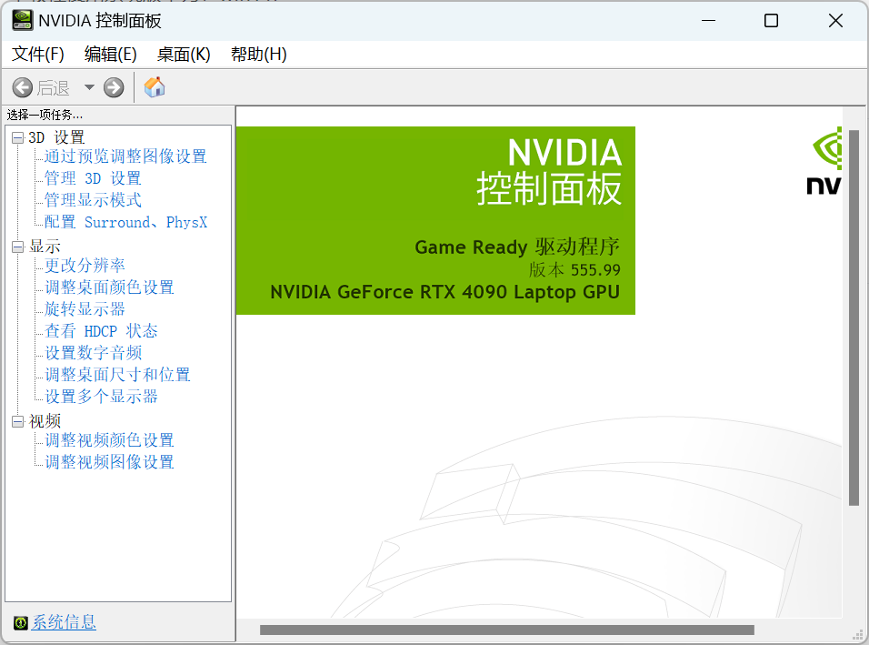
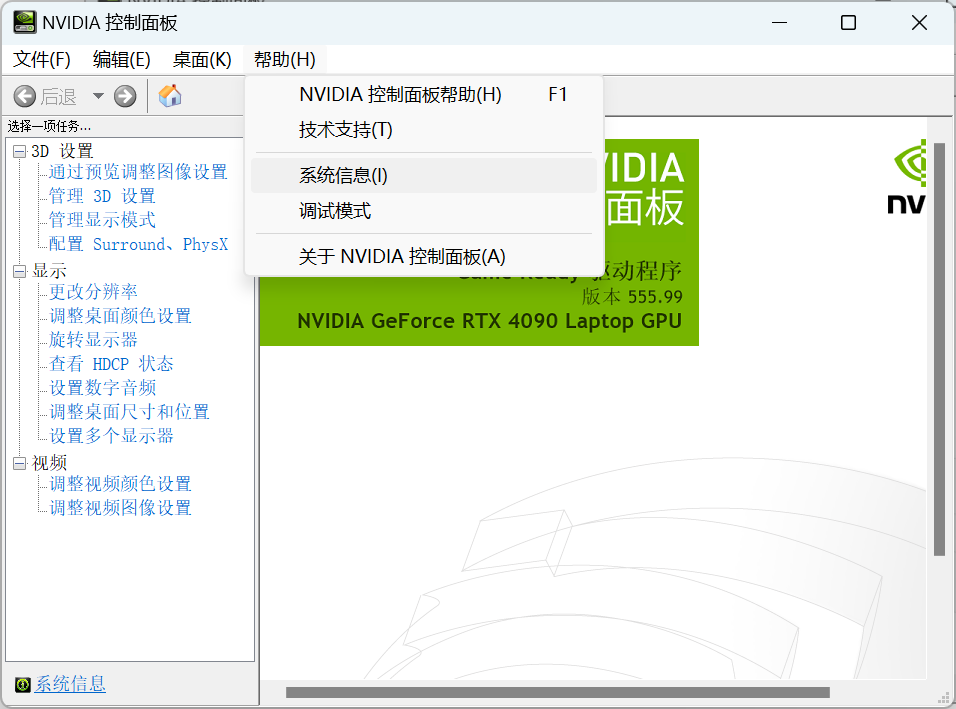
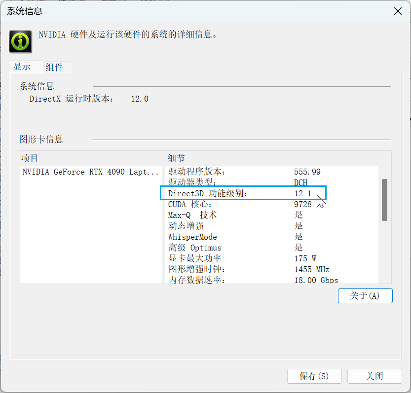
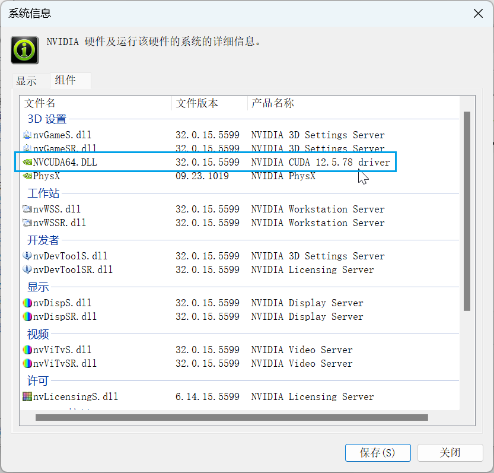

# C001-环境配置

## 系统版本

本教程使用系统版本为：win11.

## Windows 查看NVIDIA驱动支持的最高版本的CUDA

打开NVIDIA Contorl Pannel







打开组件：NVCUDA64.DLL 一栏显示的就是本系统目前支持的CUDA最高版本：



也可以直接通过cmd输出：命令：

```bash
nivida-smi
```


## 下载CUDA

下载链接：

[CUDA Toolkit Archive | NVIDIA Developer](https://developer.nvidia.com/cuda-toolkit-archive)


目前最新版为：[CUDA Toolkit 12.5.1 ](https://developer.nvidia.com/cuda-downloads)(July 2024), [Versioned Online Documentation](https://docs.nvidia.com/cuda/)

下载对应版本安装即可。

[CUDA Toolkit 12.1.0](https://developer.nvidia.com/cuda-12-1-0-download-archive) (February 2023), [Versioned Online Documentation](https://docs.nvidia.com/cuda/archive/12.1.0/)
