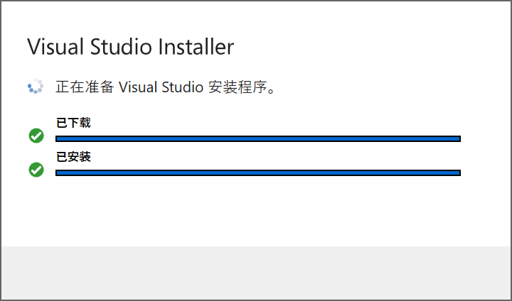
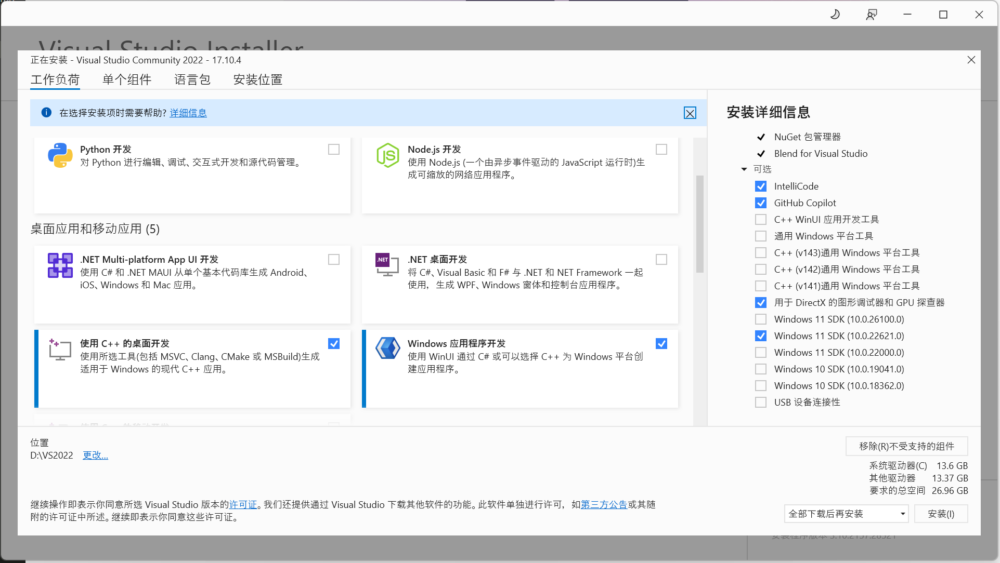
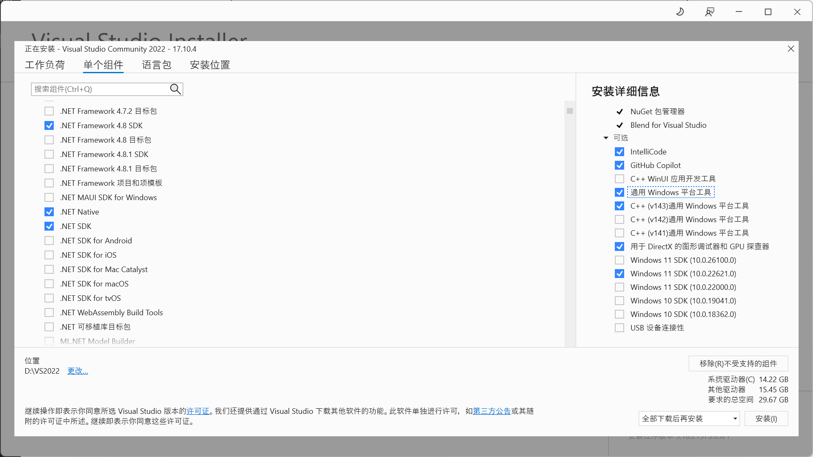
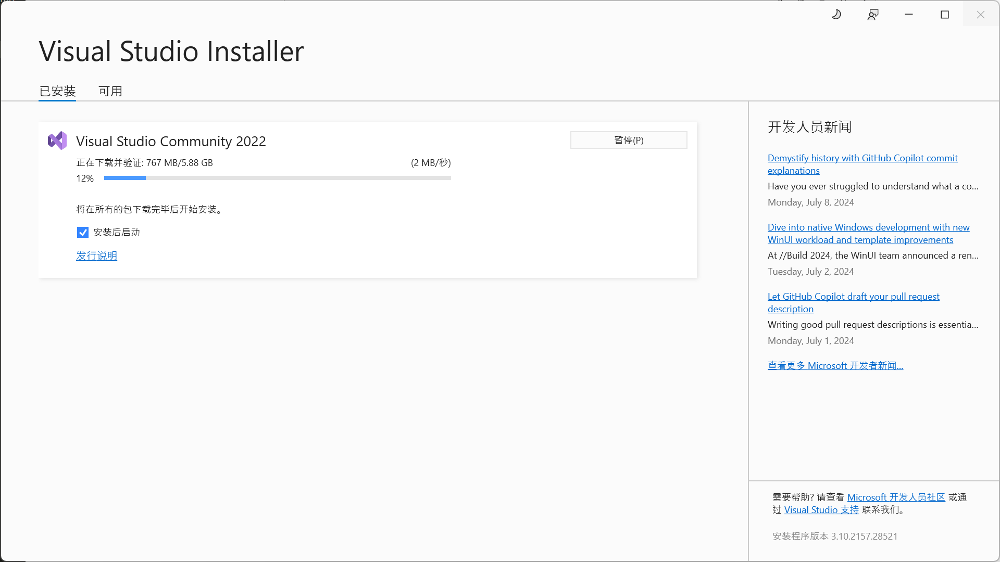
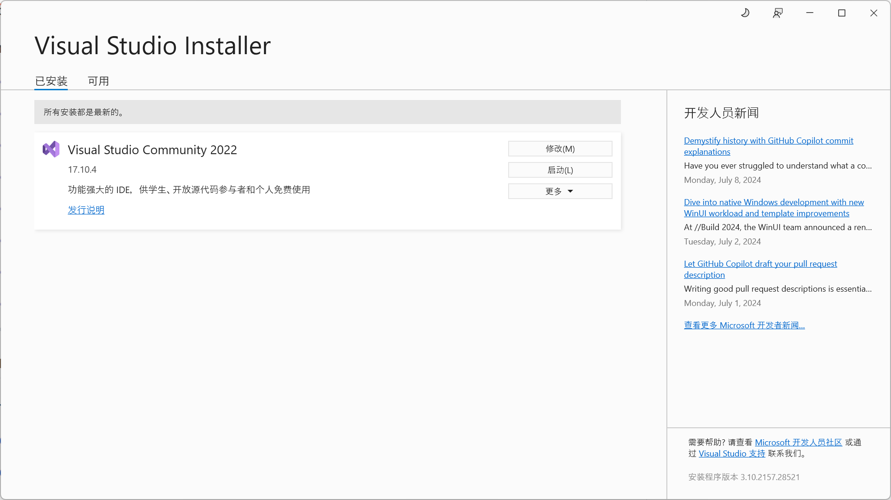
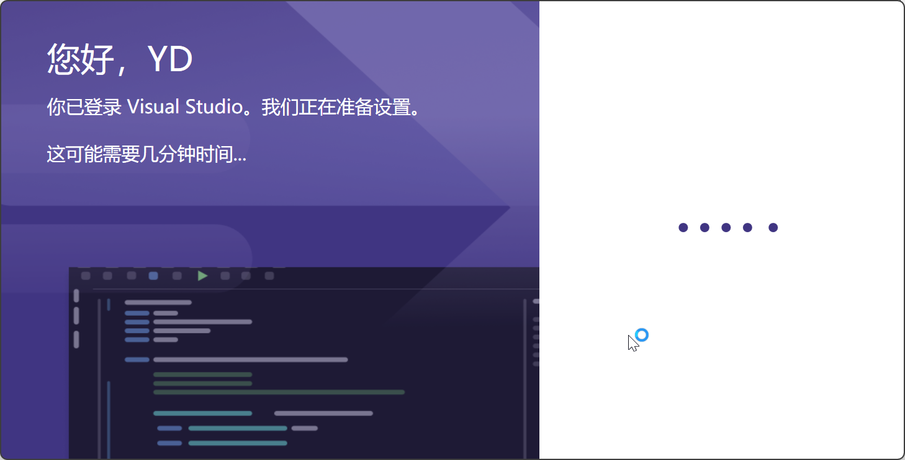
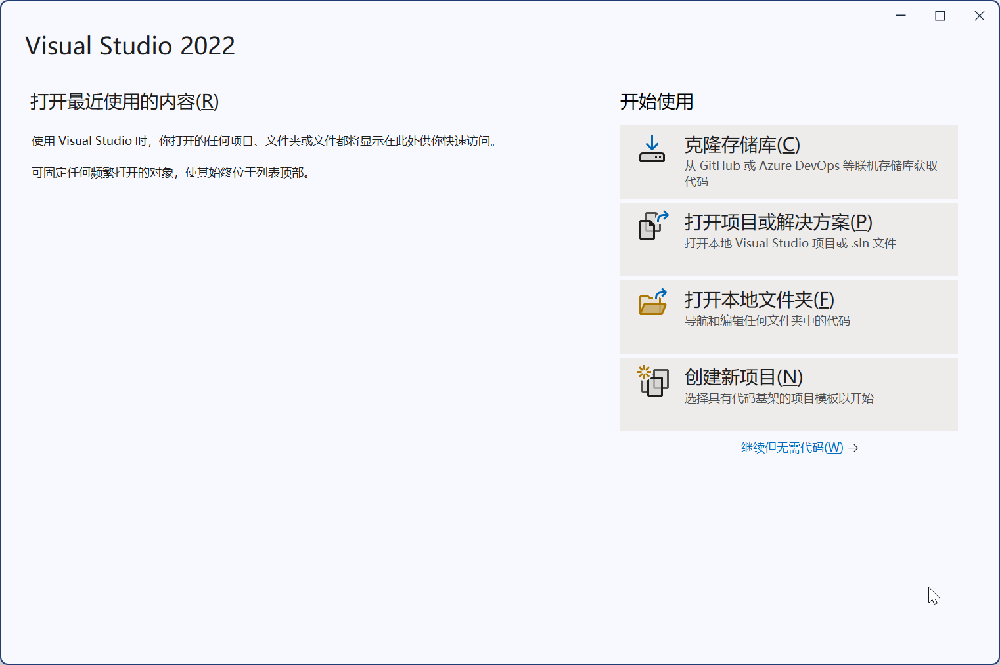
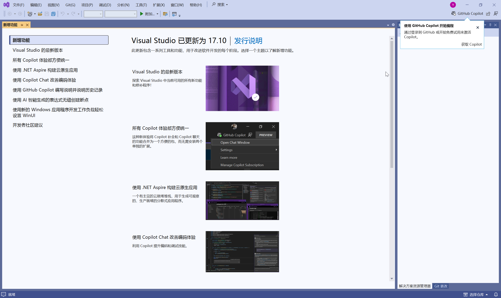

# C003-安装Visual-Studio

先安装VS2022，再安装CUDA。

## 中文官方下载

[Visual Studio 2022 IDE - 适用于软件开发人员的编程工具 (microsoft.com)](https://visualstudio.microsoft.com/zh-hans/vs/)

## 运行安装文件

## 安装中

## 安装成功

## 启动测试

