# C004-安装CUDA

先安装VS2022，再安装CUDA。

## 检查CUDA是否安装=>检查CUDA安装版本

```bash
nvcc -V
```

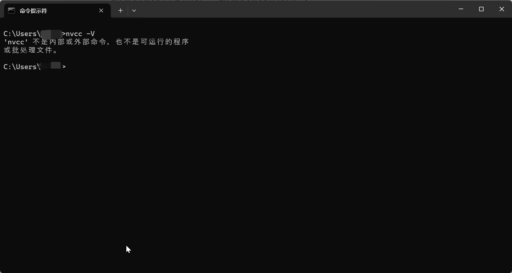

## 打开下载的CUDA->安装

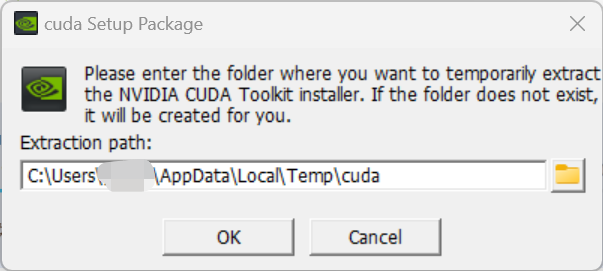

选择合适的路径：

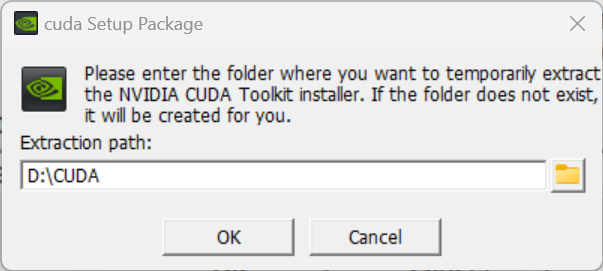

安装中：

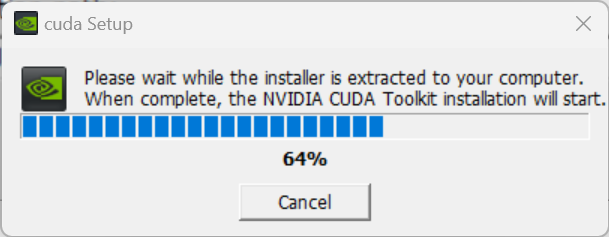

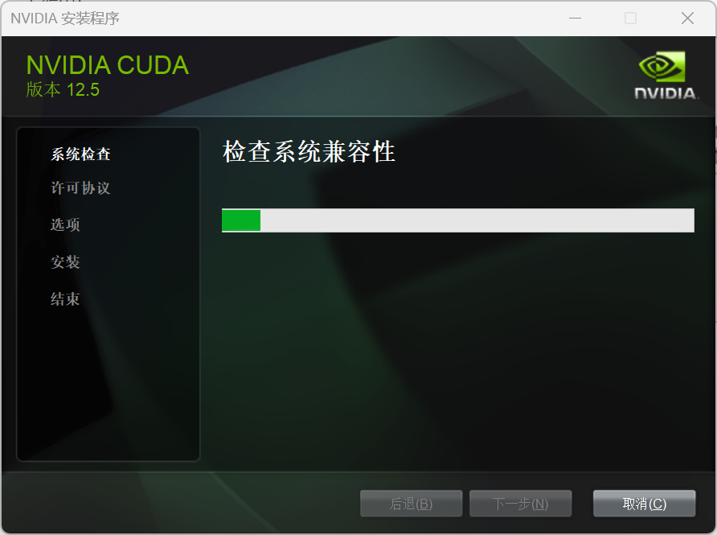

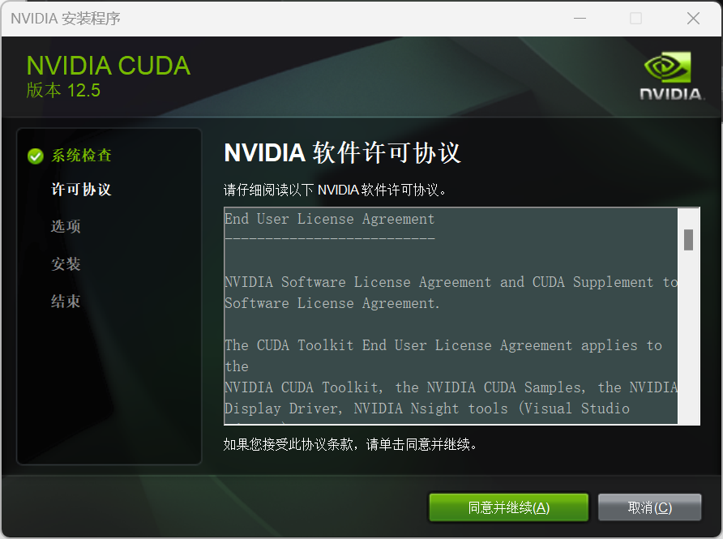

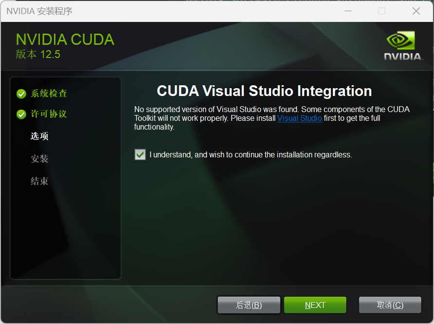

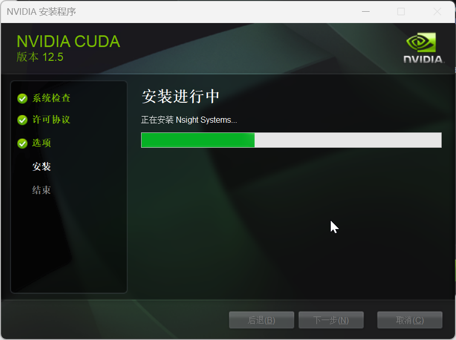

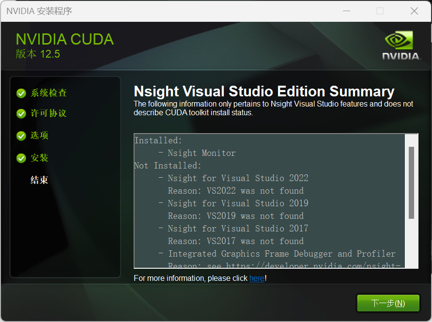

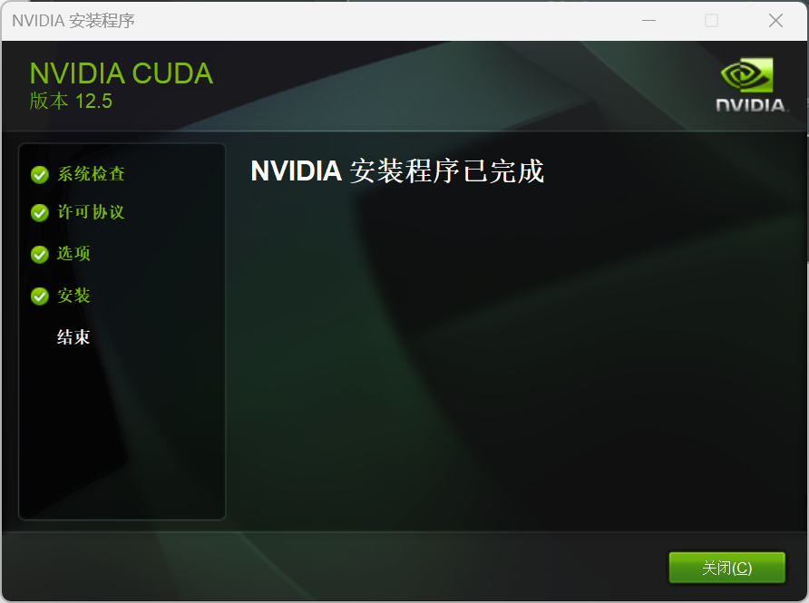

## 测试安装已完成

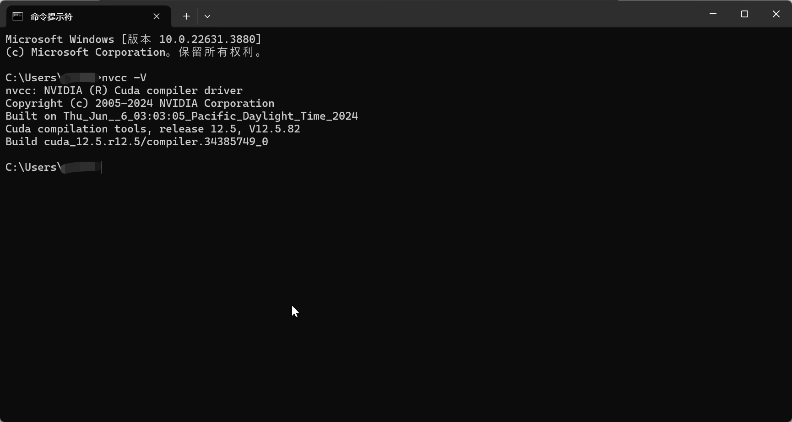

---

安装过程，先解压后安装。

## 可以选择自定义安装

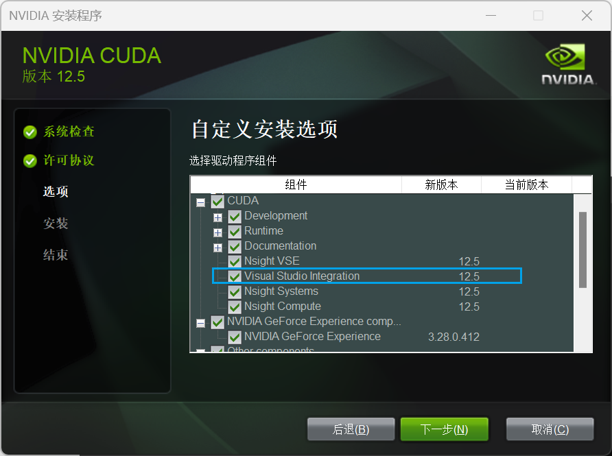


直接安装 Visual Studio Integration。

默认安装位置：

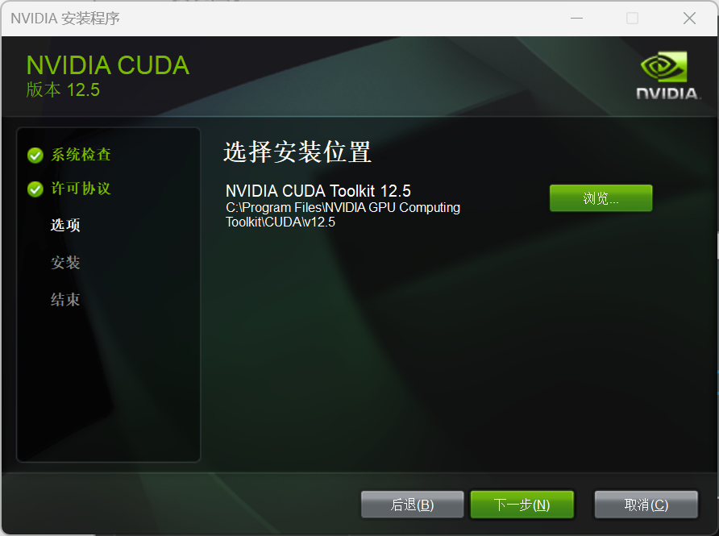

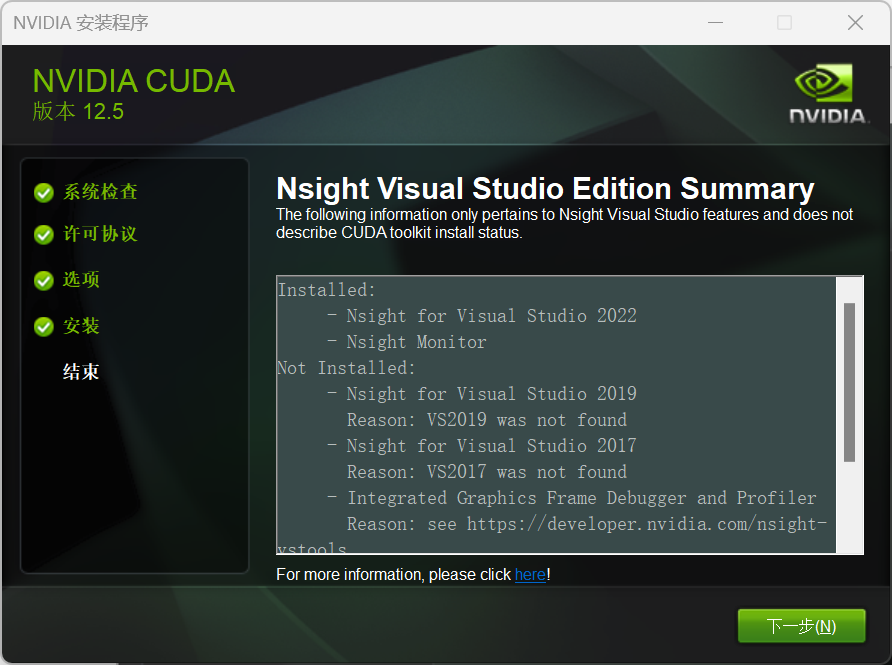


### 安装完成后，多屏拓展得到支持。
