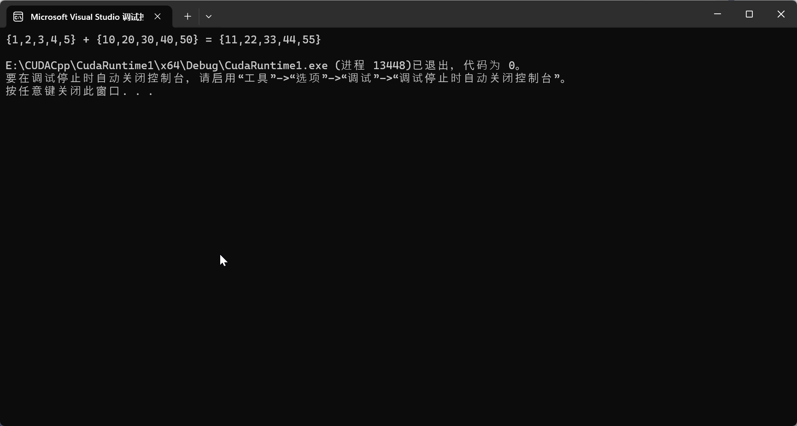

# C007-VS2022+CUDA-第一个程序-结构分析

## cu代码

代码：[../C0-Code/C1-Basic/CudaRuntime1/](../C0-Code/C1-Basic//CudaRuntime1/)

```cpp
#include "cuda_runtime.h"  // 引入运行时头文件
#include "device_launch_parameters.h"  // 引入设备参数头文件

#include <stdio.h>  // 引入标准输入输出头文件

cudaError_t addWithCuda(int *c, const int *a, const int *b, unsigned int size);  // 定义cuda:cudaError_t 函数，对应下面详细定义的addWithCuda-CUDA函数

// 定义一个全局函数
__global__ void addKernel(int *c, const int *a, const int *b)
{   
    // 获取threadIdx的现成索引
    int i = threadIdx.x;
    // 对应索引位置的值相加
    c[i] = a[i] + b[i];
}


// 主函数
int main()
{
    // 定义常量：数组的大小
    const int arraySize = 5;
    // 定义常量数组a
    const int a[arraySize] = { 1, 2, 3, 4, 5 };
    // 定义常量数组b
    const int b[arraySize] = { 10, 20, 30, 40, 50 };
    int c[arraySize] = { 0 };

    // Add vectors in parallel.
    // 调用addWithCuda函数，该函数是启动GPU计算的入口函数
    // addWithCuda 函数的返回类型是cudaError_t，这是一个枚举类型，该枚举类型可作为几乎所有CUDA函数的返回值类型。
    // cudaError_t 类型主要用来检测GPU函数执行期间发生的各种不同类型的错误。
    // 如果返回值：cudaStatus=0，则代表执行成功。
    cudaError_t cudaStatus = addWithCuda(c, a, b, arraySize);
    if (cudaStatus != cudaSuccess) {
        fprintf(stderr, "addWithCuda failed!");
        return 1;
    }

    // 输出执行GPU函数后的结构
    printf("{1,2,3,4,5} + {10,20,30,40,50} = {%d,%d,%d,%d,%d}\n",
        c[0], c[1], c[2], c[3], c[4]);

    // cudaDeviceReset must be called before exiting in order for profiling and
    // tracing tools such as Nsight and Visual Profiler to show complete traces.
    // cudaDeviceReset必须在退出之前调用，以便分析和跟踪工具，如Nsight和Visual Profiler显示完整的跟踪。
    // cudaDeviceReset函数：释放所有申请的GPU显存空间和重置GPU设备状态
    cudaStatus = cudaDeviceReset();
    if (cudaStatus != cudaSuccess) {
        fprintf(stderr, "cudaDeviceReset failed!");
        return 1;
    }

    return 0;
}

// Helper function for using CUDA to add vectors in parallel.
// 该函数用于并行地相加两个数组的值，并对应赋值给第三个数组
cudaError_t addWithCuda(int *c, const int *a, const int *b, unsigned int size)
{
    int *dev_a = 0;
    int *dev_b = 0;
    int *dev_c = 0;
    cudaError_t cudaStatus;

    // Choose which GPU to run on, change this on a multi-GPU system.
    // cudaSetDevice函数：用于选择运行的GPU-设备号
    cudaStatus = cudaSetDevice(0);
    if (cudaStatus != cudaSuccess) { // 如果选定GPU不存在
        fprintf(stderr, "cudaSetDevice failed!  Do you have a CUDA-capable GPU installed?");
        goto Error;
    }

    // Allocate GPU buffers for three vectors (two input, one output) 
    // cudaMalloc函数用于为数据分配显存空间
    // 下面三个模块是为三个数组分配显存空间

    // 分配设备c内存
    cudaStatus = cudaMalloc((void**)&dev_c, size * sizeof(int));
    if (cudaStatus != cudaSuccess) {
        fprintf(stderr, "cudaMalloc failed!");
        goto Error;
    }

    // 分配设备a内存
    cudaStatus = cudaMalloc((void**)&dev_a, size * sizeof(int));
    if (cudaStatus != cudaSuccess) {
        fprintf(stderr, "cudaMalloc failed!");
        goto Error;
    }

    // 分配设备b内存
    cudaStatus = cudaMalloc((void**)&dev_b, size * sizeof(int));
    if (cudaStatus != cudaSuccess) {
        fprintf(stderr, "cudaMalloc failed!");
        goto Error;
    }

    // Copy input vectors from host memory to GPU buffers.
    // cudaMemcpy函数用于内存之间的数据拷贝
    // cudaMemcpyHostToDevice说明了从主机内存拷贝到设备内存
    // 像cudaMemcpyHostToDevice或上面的stderr都是不需要定义的直接使用的CUDA类型确定变量

    // 从主机a内存拷贝到设备a内存
    cudaStatus = cudaMemcpy(dev_a, a, size * sizeof(int), cudaMemcpyHostToDevice);
    if (cudaStatus != cudaSuccess) {
        fprintf(stderr, "cudaMemcpy failed!");
        goto Error;
    }

    // 从主机b内存拷贝到设备b内存
    cudaStatus = cudaMemcpy(dev_b, b, size * sizeof(int), cudaMemcpyHostToDevice);
    if (cudaStatus != cudaSuccess) {
        fprintf(stderr, "cudaMemcpy failed!");
        goto Error;
    }

    // Launch a kernel on the GPU with one thread for each element.
    // 多个线程同时执行addKernel
    // <<<1, size>>>表示分配1个线程块，每个线程块分配了size个线程
    addKernel<<<1, size>>>(dev_c, dev_a, dev_b);

    // Check for any errors launching the kernel
    cudaStatus = cudaGetLastError();  // cudaGetLastError 用于获取某个CUDA运行时的调用错误
    if (cudaStatus != cudaSuccess) {
        fprintf(stderr, "addKernel launch failed: %s\n", cudaGetErrorString(cudaStatus));    // cudaGetErrorString 用于获取错误的详细信息
        goto Error;
    }
  
    // cudaDeviceSynchronize waits for the kernel to finish, and returns
    // any errors encountered during the launch.
    cudaStatus = cudaDeviceSynchronize();
    // cudaDeviceSynchronize 函数定义阻塞，等待所有的线程都完成了其任务，则执行该函数下方定义的程序。
    if (cudaStatus != cudaSuccess) {
        fprintf(stderr, "cudaDeviceSynchronize returned error code %d after launching addKernel!\n", cudaStatus);
        goto Error;
    }

    // Copy output vector from GPU buffer to host memory.
    // 计算完成后，将设备dev_c内存拷贝到主机内存c
    cudaStatus = cudaMemcpy(c, dev_c, size * sizeof(int), cudaMemcpyDeviceToHost);
    if (cudaStatus != cudaSuccess) {
        fprintf(stderr, "cudaMemcpy failed!");
        goto Error;
    }

Error:
    // cudaFree 函数用于释放申请的显存空间
    // 释放设别内存dev_c
    cudaFree(dev_c);
    // 释放设别内存dev_a
    cudaFree(dev_a);
    // 释放设别内存dev_b
    cudaFree(dev_b);
  
    return cudaStatus;
}


```

## 点击运行


