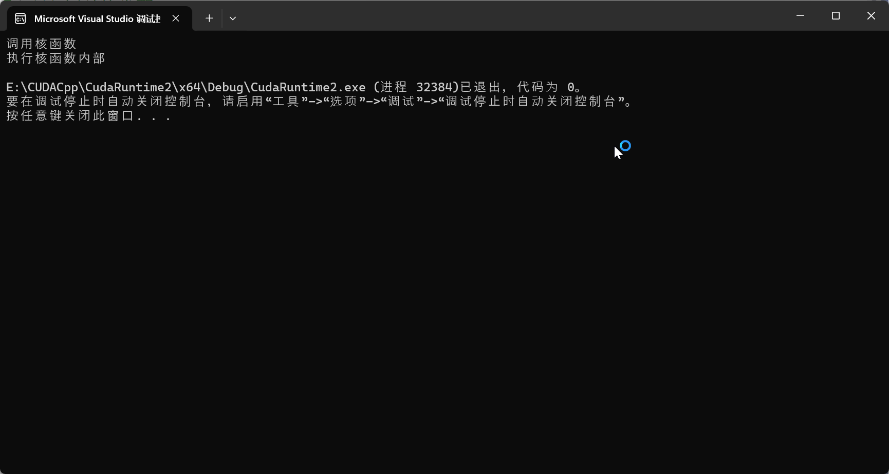

# C008-调用核函数-块与线程

## cu代码

### <<<1, 1>>> 1块1线性-调用核函数

代码：

```cpp
#include "cuda_runtime.h"  // 引入运行时头文件
#include "device_launch_parameters.h"  // 引入设备参数头文件
#include <stdio.h>  // 引入标准输入输出头文件


/// <summary>
/// 定义核函数
/// </summary>
/// <param name="">void</param>
/// <returns>void</returns>
__global__ void kernelFun(void) {
	printf("执行核函数内部\n");
}

/// <summary>
/// 主函数
/// </summary>
/// <param name="">void</param>
/// <returns>int</returns>
int main(void) {
	int n = 1;
	kernelFun <<<n, n>>>();

	printf("调用核函数\n");

	return 0;
}
```

输出：
