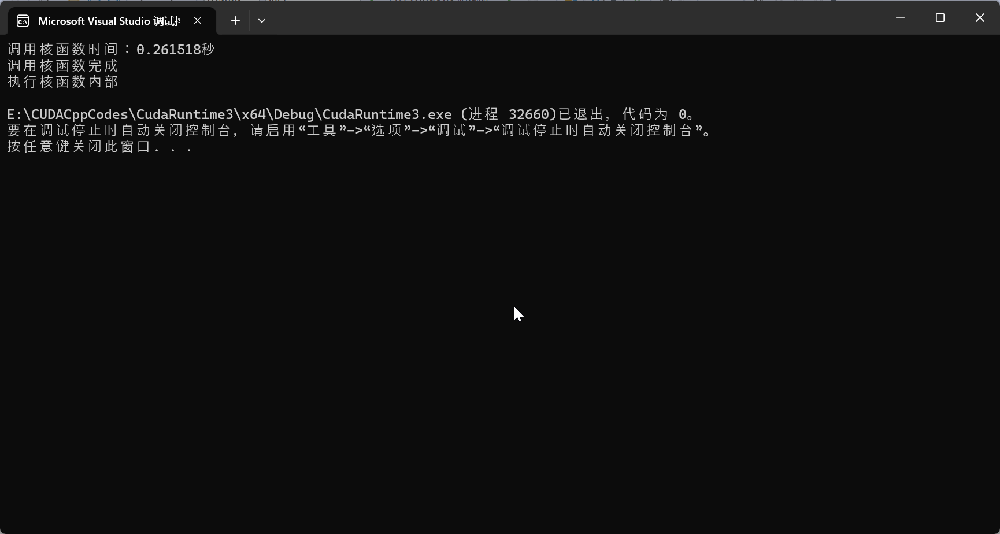

# C009-调用核函数-块与线程-计时

## cu代码

### <<<1, 1>>> 1块1线性-调用核函数

代码：[../C0-Code/C1-Basic/CudaRuntime3/](../C0-Code/C1-Basic//CudaRuntime3/)

```cpp
#include "cuda_runtime.h"  // 引入运行时头文件
#include "device_launch_parameters.h"  // 引入设备参数头文件
#include <stdio.h>  // 引入标准输入输出头文件
#include <chrono>   // 引入C11计时新库chrono
#include <iostream> 

using namespace std;  // 比如导入std才能使用命名空间chrono
using namespace chrono;


/// <summary>
/// 定义核函数
/// </summary>
/// <param name="">void</param>
/// <returns>void</returns>
__global__ void kernelFun(void) {
	printf("执行核函数内部\n");
}

/// <summary>
/// 主函数
/// </summary>
/// <param name="">void</param>
/// <returns>int</returns>
int main(void) {
	int n = 1;
	
	// ===========================================================
	auto start = system_clock::now();  // 获取当前时间-1
	// ============================================
	kernelFun <<<n, n >>> ();
	// ============================================
	auto end = system_clock::now();  // 获取当前时间-2
	// microseconds表示精确到微秒，nanoseconds表示精确到纳秒
	auto duration = duration_cast<microseconds>(end - start);  // 需要在函数内部使用duration_cast
	cout << "调用核函数时间：" << double(duration.count()) * microseconds::period::num / microseconds::period::den<< "秒" << endl;
	// ===========================================================

	printf("调用核函数完成\n");

	return 0;

}
```

输出：
