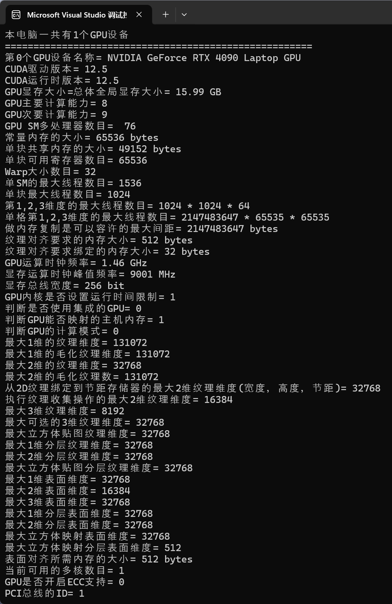

# C0011-C011-获取设备属性-获取显卡参数

## cu代码

代码：CudaRuntime4

```cpp
#include "cuda_runtime.h"  // 引入运行时头文件
#include "device_launch_parameters.h"  // 引入设备参数头文件
#include <stdio.h>  // 引入标准输入输出头文件
#include <chrono>   // 引入C11计时新库chrono
#include <iostream> 
#include <device_launch_parameters.h>  // 引入设备运行参数头文件

using namespace std;  // 比如导入std才能使用命名空间chrono
using namespace chrono;

// 获取GPU设备属性不能再Kernel核函数中进行，可以在主函数中进行

/// <summary>
/// 主函数
/// </summary>
/// <param name="">void</param>
/// <returns>int</returns>
int main(void) {
	int n = 1;

	// ===========================================================
	auto start = system_clock::now();  // 获取当前时间-1
	// ============================================
	int deviceMax;
	cudaGetDeviceCount(&deviceMax);  // 获取并设置GPU设备数目最大值
	cout << "本电脑一共有" << deviceMax << "个GPU设备" << endl;
	int d;

	for (int d = 0; d < deviceMax; d++)
	{
		int CUDA_version(0);  // 设置CUDA版本为 CUDA_version
		int Runtime_version(0);  // 设置Runtime版本为 Runtime_version
		cudaDeviceProp gpuProp;  // 设置属性存储组变量为 gpuProp

		cudaGetDeviceProperties(&gpuProp, d);
		cout << "======================================================" << endl;
		cout << "第" << d << "个GPU设备名称= " << gpuProp.name << endl;
		cudaDriverGetVersion(&CUDA_version);  // 获取设置CUDA驱动版本
		cudaRuntimeGetVersion(&Runtime_version);  // 获取设置CUDA运行时版本

		printf("CUDA驱动版本= %d.%d\n", CUDA_version / 1000, (CUDA_version % 1000) / 10);
		printf("CUDA运行时版本= %d.%d\n", Runtime_version / 1000, (Runtime_version % 1000) / 10);
		printf("GPU显存大小=总体全局显存大小= %.2f GB\n", (gpuProp.totalGlobalMem / 1024 / 1024 / 1024.0));
		printf("GPU主要计算能力= %d \n", gpuProp.major);
		printf("GPU次要计算能力= %d \n", gpuProp.minor);
		printf("GPU SM多处理器数目=  %d\n", gpuProp.multiProcessorCount);
		printf("常量内存的大小= %lld bytes\n", gpuProp.totalConstMem);
		printf("单块共享内存的大小= %lld bytes\n", gpuProp.sharedMemPerBlock);
		printf("单块可用寄存器数目= %d\n", gpuProp.regsPerBlock);
		printf("Warp大小数目= %d\n", gpuProp.warpSize);
		printf("单SM的最大线程数目= %d\n",gpuProp.maxThreadsPerMultiProcessor);
		printf("单块最大线程数目= %d\n", gpuProp.maxThreadsPerBlock);
		printf("第1,2,3维度的最大线程数目= %d * %d * %d\n", gpuProp.maxThreadsDim[0], gpuProp.maxThreadsDim[1], gpuProp.maxThreadsDim[2]);
		printf("单格第1,2,3维度的最大线程数目= %d * %d * %d\n", gpuProp.maxGridSize[0], gpuProp.maxGridSize[1], gpuProp.maxGridSize[2]);
		printf("做内存复制是可以容许的最大间距= %lld bytes\n", gpuProp.memPitch);
		printf("纹理对齐要求的内存大小= %lld bytes\n", gpuProp.textureAlignment);
		printf("纹理对齐要求绑定的内存大小= %lld bytes\n", gpuProp.texturePitchAlignment);
		printf("GPU运算时钟频率= %.2f GHz\n", gpuProp.clockRate * 1e-6f);
		printf("显存运算时钟峰值频率= %.0f MHz\n", gpuProp.memoryClockRate * 1e-3f);
		printf("显存总线宽度= %d bit\n", gpuProp.memoryBusWidth);
		printf("GPU内核是否设置运行时间限制= %d \n", gpuProp.kernelExecTimeoutEnabled);
		printf("判断是否使用集成的GPU= %d \n", gpuProp.integrated);
		printf("判断GPU能否映射的主机内存= %d\n", gpuProp.canMapHostMemory);
		printf("判断GPU的计算模式= %d\n", gpuProp.computeMode);
		printf("最大1维的纹理维度= %d\n", gpuProp.maxTexture1D);
		printf("最大1维的毛化纹理维度= %d\n", gpuProp.maxTexture1D);
		printf("最大2维的纹理维度= %d\n", gpuProp.maxTexture2D[2]);
		printf("最大2维的毛化纹理数= %d\n", gpuProp.maxTexture2DMipmap[2]);
		printf("从2D纹理绑定到节距存储器的最大2维纹理维度(宽度，高度，节距)= %d\n", gpuProp.maxTexture2DLinear[3]);
		printf("执行纹理收集操作的最大2维纹理维度= %d\n", gpuProp.maxTexture2DGather[2]);
		printf("最大3维纹理维度= %d\n", gpuProp.maxTexture3D[3]);
		printf("最大可选的3维纹理维度= %d\n", gpuProp.maxTexture3DAlt[3]);
		printf("最大立方体贴图纹理维度= %d\n", gpuProp.maxTextureCubemap);
		printf("最大1维分层纹理维度= %d\n", gpuProp.maxTexture1DLayered[2]);
		printf("最大2维分层纹理维度= %d\n", gpuProp.maxTexture2DLayered[3]);
		printf("最大立方体贴图分层纹理维度= %d\n", gpuProp.maxTextureCubemapLayered[2]);
		printf("最大1维表面维度= %d\n", gpuProp.maxSurface1D);
		printf("最大2维表面维度= %d\n", gpuProp.maxSurface2D[2]);
		printf("最大3维表面维度= %d\n", gpuProp.maxSurface3D[3]);
		printf("最大1维分层表面维度= %d\n", gpuProp.maxSurface1DLayered[2]);
		printf("最大2维分层表面维度= %d\n", gpuProp.maxSurface2DLayered[3]);
		printf("最大立方体映射表面维度= %d\n", gpuProp.maxSurfaceCubemap);
		printf("最大立方体映射分层表面维度= %d\n", gpuProp.maxSurfaceCubemapLayered[2]);
		printf("表面对齐所需内存的大小= %lld bytes\n", gpuProp.surfaceAlignment);
		printf("当前可用的多核数目= %d\n", gpuProp.concurrentKernels);
		printf("GPU是否开启ECC支持= %d\n", gpuProp.ECCEnabled);
		printf("PCI总线的ID= %d\n", gpuProp.pciBusID);
		printf("PCI设备的ID= %d\n", gpuProp.pciDeviceID);
		printf("PCI区域的ID= %d\n", gpuProp.pciDomainID);
		printf("判断GPU是否支持TCC= %d\n", gpuProp.tccDriver);
		printf("异步引擎数目= %d\n", gpuProp.asyncEngineCount);
		printf("判断GPU是否与主机共享统一地址空间= %d\n", gpuProp.asyncEngineCount);
		printf("L2级缓存大小= %ld bytes\n", gpuProp.l2CacheSize);
		printf("判断GPU是否支持流属性= %d\n", gpuProp.streamPrioritiesSupported);
		printf("判断GPU是否支持全局L1级缓存= %d\n", gpuProp.globalL1CacheSupported);
		printf("判断GPU是否支持本地L1级缓存= %d\n", gpuProp.localL1CacheSupported);
		printf("单个多处理器共享的可用内容= %lld bytes\n", gpuProp.sharedMemPerMultiprocessor);
		printf("单个多处理器可用的32位寄存器数目= %d\n", gpuProp.localL1CacheSupported);
		printf("判断GPU是否支持分配管理内存= %d\n", gpuProp.managedMemory);
		printf("判断GPU是否多个GPU共用一个板= %d\n", gpuProp.isMultiGpuBoard);
		printf("同一板子的同一个GPU集群的唯一ID= %d\n", gpuProp.multiGpuBoardGroupID);
		cout << "======================================================" << endl;

	}
	// ============================================
	auto end = system_clock::now();  // 获取当前时间-2
	// microseconds表示精确到微秒，nanoseconds表示精确到纳秒
	auto duration = duration_cast<microseconds>(end - start);  // 需要在函数内部使用duration_cast
	cout << "获取GPU设备属性-时间：" << double(duration.count()) * microseconds::period::num / microseconds::period::den << "秒" << endl;
	// ===========================================================

	printf("主函数完成\n");

	return 0;

}
```

## 输出：

```bash
本电脑一共有1个GPU设备
======================================================
第0个GPU设备名称= NVIDIA GeForce RTX 4090 Laptop GPU
CUDA驱动版本= 12.5
CUDA运行时版本= 12.5
GPU显存大小=总体全局显存大小= 15.99 GB
GPU主要计算能力= 8
GPU次要计算能力= 9
GPU SM多处理器数目=  76
常量内存的大小= 65536 bytes
单块共享内存的大小= 49152 bytes
单块可用寄存器数目= 65536
Warp大小数目= 32
单SM的最大线程数目= 1536
单块最大线程数目= 1024
第1,2,3维度的最大线程数目= 1024 * 1024 * 64
单格第1,2,3维度的最大线程数目= 2147483647 * 65535 * 65535
做内存复制是可以容许的最大间距= 2147483647 bytes
纹理对齐要求的内存大小= 512 bytes
纹理对齐要求绑定的内存大小= 32 bytes
GPU运算时钟频率= 1.46 GHz
显存运算时钟峰值频率= 9001 MHz
显存总线宽度= 256 bit
GPU内核是否设置运行时间限制= 1
判断是否使用集成的GPU= 0
判断GPU能否映射的主机内存= 1
判断GPU的计算模式= 0
最大1维的纹理维度= 131072
最大1维的毛化纹理维度= 131072
最大2维的纹理维度= 32768
最大2维的毛化纹理数= 131072
从2D纹理绑定到节距存储器的最大2维纹理维度(宽度，高度，节距)= 32768
执行纹理收集操作的最大2维纹理维度= 16384
最大3维纹理维度= 8192
最大可选的3维纹理维度= 32768
最大立方体贴图纹理维度= 32768
最大1维分层纹理维度= 32768
最大2维分层纹理维度= 32768
最大立方体贴图分层纹理维度= 32768
最大1维表面维度= 32768
最大2维表面维度= 16384
最大3维表面维度= 32768
最大1维分层表面维度= 32768
最大2维分层表面维度= 32768
最大立方体映射表面维度= 32768
最大立方体映射分层表面维度= 512
表面对齐所需内存的大小= 512 bytes
当前可用的多核数目= 1
GPU是否开启ECC支持= 0
PCI总线的ID= 1
PCI设备的ID= 0
PCI区域的ID= 0
判断GPU是否支持TCC= 0
异步引擎数目= 1
判断GPU是否与主机共享统一地址空间= 1
L2级缓存大小= 67108864 bytes
判断GPU是否支持流属性= 1
判断GPU是否支持全局L1级缓存= 1
判断GPU是否支持本地L1级缓存= 1
单个多处理器共享的可用内容= 102400 bytes
单个多处理器可用的32位寄存器数目= 1
判断GPU是否支持分配管理内存= 1
判断GPU是否多个GPU共用一个板= 0
同一板子的同一个GPU集群的唯一ID= 0
======================================================
获取GPU设备属性-时间：0.060328秒
主函数完成

E:\CUDACppCodes\C1-Basic\CudaRuntime4\x64\Debug\CudaRuntime4.exe (进程 33680)已退出，代码为 0。
要在调试停止时自动关闭控制台，请启用“工具”->“选项”->“调试”->“调试停止时自动关闭控制台”。
按任意键关闭此窗口. . .
```

